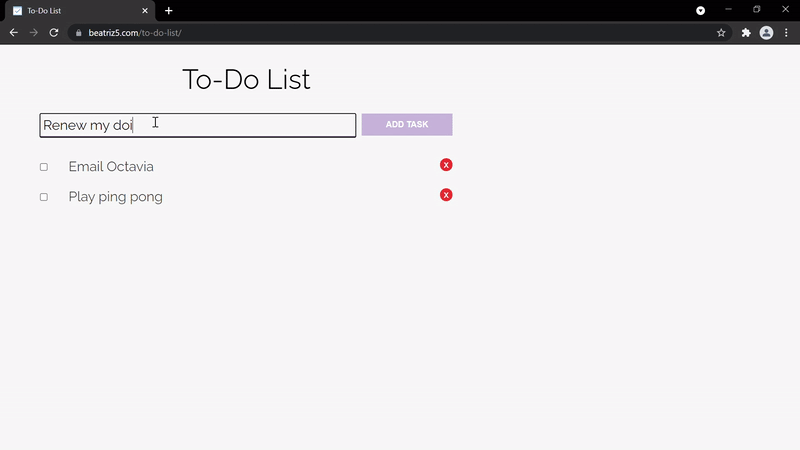

# To-Do List

A to-do list website to manage my/your tasks. To create a task, type it in the input box and click "ADD TASK". When completed, mark the task checkbox to strike it through. Finally, to delete, press the x button. 

## Demonstration

https://beatriz5.github.io/to-do-list/

## Built With

* HTML + CSS + JavaScript
* Webstorm 2021.1.1
* Visual Studio Code

## Author

* Beatriz https://github.com/beatriz5

## Acknowledgments

https://github.com/debugnik

https://developer.mozilla.org/en-US/docs/Web/API/Window/localStorage

https://ezgif.com/
